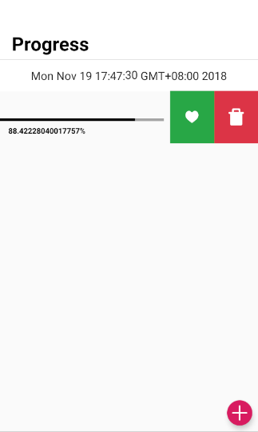

# Progress
Time always goes so fast and waits for no one.I develop this application, to hope that I can seize time with my family,
friends, and stranger.
# How to use
download the latest release apk file and install on your android device.
# Tips
1. how to use widget  
When you install the application, you can press the home screen and add progress widget. By default, the widget will
display the year progress.
2. how to change progress on widget  
To change the progress on widget, you can swipe left the progress item on screen, and click the love button.
3. how to delete progress  
Same with change default widget progress, you can swipe let the progress item and click the delete button.
4. how to add new progress  
Click the add button, input the data to add a new progress.

